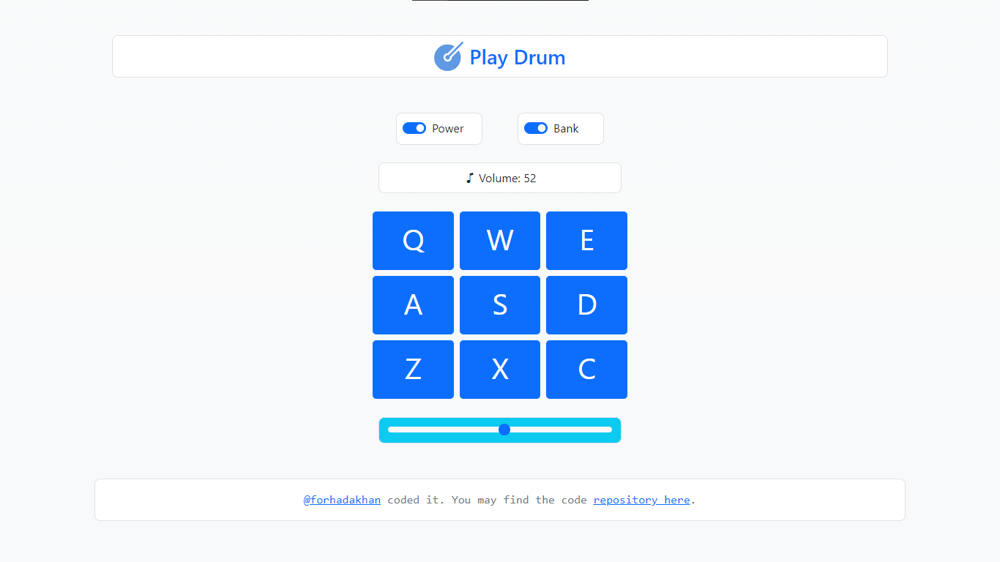

# Drum Machine

A simple drum machine application built with React.



## Features

- Power switch to turn the drum machine on and off.
- Bank switch to toggle between two sets of drum sounds.
- Drum pads with corresponding keyboard keys to play drum sounds.
- Volume control to adjust the volume of the drum sounds.
- Real-time display of the currently played sound and volume level.

## Technologies Used

- **React**: JavaScript library for building user interfaces.
- **Bootstrap**: CSS framework for styling the user interface.
- **HTML5** audio element: Used to play the drum sounds.
- **JavaScript** event handling: Used to detect key presses and button clicks.

## Usage

1. Clone the repository:

   ```bash
    git clone https://github.com/forhadakhan/play-drum.git
   ```
2. Install the dependencies: 
   ```bash
    cd drum-machine
    npm install
   ```
3. Start the development server: 
   ```bash
    npm start
   ```
Open your web browser and visit http://localhost:3000 to view the drum machine application. 

## Keyboard Controls
- Press the corresponding _keyboard keys_ (**Q, W, E, A, S, D, Z, X, C**) to play the drum sounds.
- Ensure that the **power switch** is turned **on** for the keyboard controls to work. 
- Use **bank switch** to toggle between two sets of drum sounds.

## Credits
- Drum sounds and task: [freeCodeCamp](https://www.freecodecamp.org/) 

## License
This project is licensed under the MIT License. See the [LICENSE](./LICENSE.txt) file for more information. 